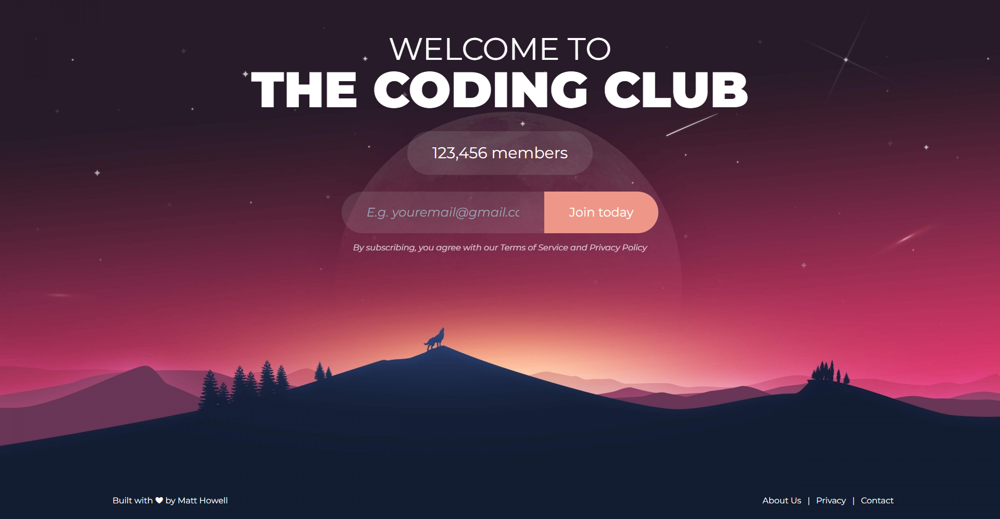

## Landing Page
A landing page built with `React` to help you capture leads.



### Getting Started
To get a local copy up and running, please follow these simple steps.

#### Prerequisites
Here is what you need to be able to run the web.
- Node.js (Version: >= 16.x.x < 17).
- `pnpm` (recommended) but you can use `npm` instead.

#### Crafted with:
- [Vite](https://vite.dev/).
- [React](https://react.dev/).
- [Tailwind](https://tailwindcss.com/).
- [PostCSS](https://postcss.org/).

#### Development
1. Clone the repository.
```sh
git clone https://github.com/mhowell07/react-landing-page.git
```

2. Go to project folder.
```sh
cd react-landing-page
```

3. Install dependencies from `package.json`.
```sh
pnpm install

# or
npm i
```

4. Start the project.
```sh
pnpm dev
```

### Screenshots


### LICENSE
This project is for open use, you can contribute to the project reporting an issue or pushing a feature or fix using a pull request.

Built by Matt Howell.